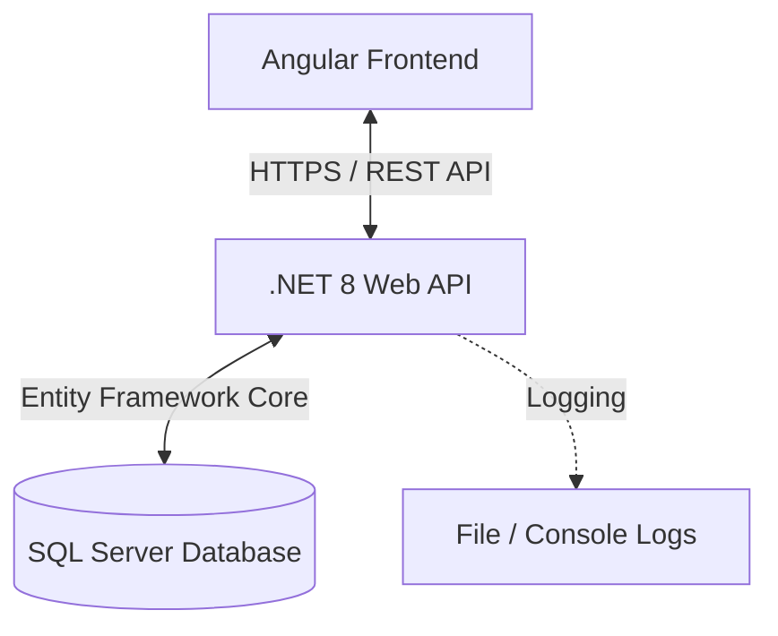

# Interview Preparation Platform - Application Flow
> **Version**: 1.0.0
> **Date**: March 2026

This document details the complete end-to-end user and data flow for the Interview Preparation Platform, covering the Frontend (Angular), Backend (.NET 8 Web API), and Database (SQL Server).

---

## 1. High-Level Architecture Flow

### 1.1 Core Technologies
*   **Frontend**: Angular 17+, Tailwind CSS (Dark Modern SaaS Theme), RxJS signals.
*   **Backend**: .NET 8 Web API, Clean Architecture, CQRS pattern (via Services), FluentValidation.
*   **Database**: SQL Server accessed via Entity Framework Core.
*   **Security**: ASP.NET Core Identity, JWT Bearer Tokens, Role-Based Access Control (RBAC).

---

## 2. Authentication & Authorization Flow

All interactions (except Login/Register) require a valid JSON Web Token (JWT).

### 2.1 Registration Flow
1. **User Action**: User navigates to `/register` and submits email and password.
2. **Frontend**: Calls `POST /api/auth/register`.
3. **Backend API**:
   - Validates the payload.
   - Uses `UserManager<ApplicationUser>` to create the user in the database.
   - Assigns default Role (`User`).
4. **Database**: Inserts a new row into `AspNetUsers` and `AspNetUserRoles`.
5. **Response**: Returns success. Frontend redirects to `/login`.

### 2.2 Login Flow
1. **User Action**: User navigates to `/login` and submits credentials.
2. **Frontend**: Calls `POST /api/auth/login`.
3. **Backend API**:
   - Validates credentials using `SignInManager`.
   - On success, generates a JWT containing the user's `NameIdentifier` (ID), `Email`, and `Role` claims.
4. **Frontend**:
   - Stores the JWT in local storage.
   - Parses the JWT payload to determine the user's role.
   - Redirects to `/admin` (if Admin/Editor) or `/` (Dashboard, for regular Users).
5. **Subsequent Requests**: The Angular `AuthInterceptor` attaches `Authorization: Bearer <token>` to all outgoing API requests.

---

## 3. End-User Flow (Candidate Journey)

This represents the flow for a standard user logging in to practice questions.

### 3.1 Loading the Dashboard (`/`)
1. **Frontend Initialization**:
   - The `AppLayoutComponent` loads the Top Navbar and Sidebar.
   - Fetches the Category Tree: `GET /api/categories`.
2. **Category Selection**:
   - User clicks a category (e.g., "Backend" -> ".NET") in the `SidebarComponent`.
   - The active category ID triggers an update in the Dashboard view.
3. **Fetching Questions & Progress**:
   - Frontend calls `GET /api/questions?categoryId={id}`.
   - Frontend calls `GET /api/userprogress` to sync the user's completed/bookmarked questions.
4. **Display**: Questions render as stylized cards. Progress cards update to show completion stats (e.g., "5/20 Easy").

### 3.2 Interacting with Questions
1. **Reveal Answer**:
   - User clicks "Show Answer". The card expands using an accordion animation to reveal Markdown-rendered text.
2. **Mark as Solved / Revision**:
   - User clicks the Checkmark (Solved) or Bookmark (Revision) toggle.
   - **Frontend**: Optimistically updates the UI state and progress bars immediately.
   - **Backend Call**: `POST /api/userprogress/toggle` is sent asynchronously.
   - **Database**: Upserts a record in the `UserProgresses` table linking the `UserId` and `QuestionId`.

---

## 4. Admin Workspace Flow (Content Management)

The Admin Workspace (`/admin`) is restricted to users with the `Admin` or `Editor` roles.

### 4.1 Admin Dashboard Initialization
1. **Frontend Navigation**: User clicks the "Admin Workspace" link. Handled by `AdminLayoutComponent`.
2. **Tab: 📊 Dashboard**:
   - Calls `GET /api/admin/dashboard` to retrieve aggregate metrics.
   - Calculates dynamic width percentages for the "By Difficulty" visual bars.
   - Displays a rolling feed of `AuditLogs` showing who created/edited content recently.

### 4.2 Content Management Flow (Questions)
1. **View Questions**:
   - Administrator opens the `❓ Questions` tab.
   - Frontend requests `GET /api/admin/questions?page=1&pageSize=20`.
   - Supports live filtering by mapping dropdowns to API query parameters (`?difficulty=Hard&status=Draft`).
2. **Create / Edit Question**:
   - Administrator clicks "New Question" or an "Edit" icon.
   - A modal opens containing an inline Markdown editor.
   - Administrator types the answer in Markdown and can toggle the "Preview" pane to see the rendered HTML in real-time.
   - Upon save, `POST /api/admin/questions` or `PUT /api/admin/questions/{id}` is executed.
   - **Backend**:
     - Updates the `Questions` and `Answers` tables.
     - Automatically creates a new schema snapshot in the `QuestionVersions` table (for version history).
     - Appends an immutable record to the `AuditLogs` table.

### 4.3 Soft Delete & Restore Flow
To prevent accidental data loss:
1. **Deletion**:
   - Admin clicks "Delete" on a Question.
   - Calls `DELETE /api/admin/questions/{id}`.
   - **Backend**: Sets `IsDeleted = true` and `DeletedAt = DateTime.UtcNow`. The Question is excluded from standard user API calls via Entity Framework global query filters.
2. **Recovery**:
   - Admin enables the "Show Deleted" filter.
   - Soft-deleted rows appear dimmed in the data table.
   - Clicking "Restore" triggers `POST /api/admin/questions/{id}/restore`, resetting the flags.

### 4.4 Bulk Import Flow (Data Ingestion)
To rapidly onboard new question banks:
1. **User Action**: Administrator drags and drops a `.json`, `.csv`, or `.xlsx` file into the "📥 Import" tab dropzone.
2. **Backend Submission**:
   - Sent as `multipart/form-data` to `POST /api/admin/import`.
   - Administrator can toggle the "Dry Run" flag (`dryRun=true`).
3. **Backend Processing**:
   - Determines parser based on extension (custom CSV parsing or `System.Text.Json`).
   - Maps each row to internal `ImportQuestionRowDto`.
   - Looks up Category IDs belonging to the provided `CategorySlug`.
   - If `DryRun=false`, inserts valid rows into `Questions` and `Answers` in a batch.
4. **Response Feedback**:
   - API returns a `BulkImportResultDto` indicating `imported`, `skipped`, `failed` counts, alongside explicit string arrays of `errors` and `warnings` indicating exactly which rows failed validation.
   - The Angular App displays colored toast badges summarizing the ingestion status.

---

## 5. Security & Data Integrity

*   **Audit Trails**: Every mutating action in the generic Domain (Creates, Updates, Deletes, Restores, Imports) is logged explicitly to `AuditLogs`.
*   **Version History**: Modifying a question saves an append-only JSON snapshot in `QuestionVersions`, ensuring previous revisions are never lost.
*   **RBAC**: Admin controllers utilize the `[Authorize(Roles = "Admin,Editor")]` attribute, throwing `403 Forbidden` if standard users attempt direct API access.
*   **Validation**: Backend data flows through strongly-typed DTOs validated instantly upon entry to controllers.
