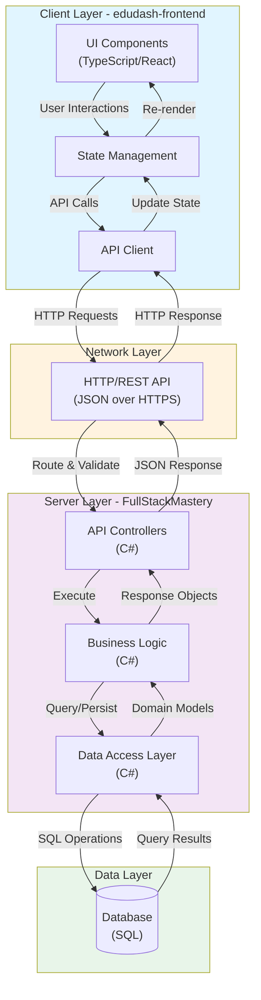

# Full Stack Mastery - Architecture Overview

This document provides a visual overview of the full-stack architecture for the FullStackMastery and edudash-frontend projects.

## System Architecture

## Technology Stack

### Frontend (edudash-frontend)
- **Language**: TypeScript (73.5%)
- **Markup**: HTML (22.9%)
- **Styling**: SCSS (3.6%)
- **Framework**: React (assumed)
- **Build Tool**: Likely Webpack/Vite

### Backend (FullStackMastery)
- **Language**: C# (66.8%)
- **Web Framework**: ASP.NET Core (assumed)
- **Language Support**: TypeScript (31.5%) for tooling/scripts
- **Other**: (1.7%) - Configuration files, scripts, etc.

### Data Layer
- **Database**: SQL-based (SQL Server, PostgreSQL, or similar)

## Communication Flow

1. **Client Request**: User interacts with the UI, triggering a state change
2. **API Call**: State management system makes an HTTP request to the backend
3. **Server Processing**: 
   - Controller receives and validates the request
   - Business logic processes the request
   - Data access layer queries/updates the database
4. **Response**: Server returns JSON response to client
5. **UI Update**: Client updates state and re-renders components

## Key Components

### Frontend Components
- **UI Layer**: React components with TypeScript for type safety
- **State Management**: Centralized state for application data
- **API Client**: HTTP client for backend communication

### Backend Components
- **API Controllers**: Entry point for HTTP requests
- **Business Logic**: Core application logic and rules
- **Data Access**: ORM or SQL queries for database operations

---

*This architecture supports a scalable, maintainable full-stack application with clear separation of concerns between client and server.*
