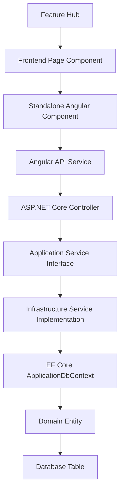

# Review: FullStackMastery Architecture Knowledge Graph Builder Plan

This document reviews the proposed prompt plan for building an Obsidian-based Architecture Knowledge Graph for the **FullStackMastery** project. 

It highlights the key architectural discrepancies between the hypothetical template and the actual codebase, provides a corrected mapping of data/knowledge flow, identifies the real feature hubs present in the repository, and provides a corrected version of the prompt/builder directive that can be committed to the vault.

---

## 1. Key Architectural Gaps & Corrections

Comparing the proposed prompt's assumptions to the actual implementation details in [TRD.md](file:///d:/Projects/Full%20Stack%20%28Angular%29/FullStackMastery/FullStackMastery/docs/Architecture/TRD.md) and [ENGINEERING_PLAYBOOK.md](file:///d:/Projects/Full%20Stack%20%28Angular%29/FullStackMastery/FullStackMastery/docs/Architecture/ENGINEERING_PLAYBOOK.md), we identify the following misalignments:

### A. Backend Patterns: Standard Clean Architecture vs. CQRS & MediatR
* **Hypothesis in Plan**: The plan assumes a CQRS pattern with MediatR:
  * Node flow: `Controller` → `CQRS Command` → `Handler` → `Repository` → `Entity`.
  * Artifacts: `SubmitAssessmentCommand.md`, `SubmitAssessmentHandler.md`, `AssessmentRepository.md`.
* **Reality in Code**: The project *explicitly forbids* CQRS and MediatR (as per [TRD.md §1.2](file:///d:/Projects/Full%20Stack%20%28Angular%29/FullStackMastery/FullStackMastery/docs/Architecture/TRD.md#L31-L38)). The backend uses standard dependency injection with service interfaces and implementations.
  * Node flow: `Controller` → `Service Interface (Application)` → `Service Implementation (Infrastructure)` → `EF Core DbContext` → `Domain Entity` → `Database Table`.
  * Corrected Artifacts: `QuestionsController.md`, `IQuestionService.md`, `QuestionService.md`, `Question.md`.

### B. Styling: Tailwind CSS vs. Custom CSS
* **Hypothesis in Plan**: Tailwind CSS is assumed.
* **Reality in Code**: The frontend uses a custom CSS/SCSS design system for its dark SaaS theme (refer to `frontend/src/app/styles.scss` and [TRD.md §1.1](file:///d:/Projects/Full%20Stack%20%28Angular%29/FullStackMastery/FullStackMastery/docs/Architecture/TRD.md#L16-L29)). 

### C. Database Layer: SQL Server and PostgreSQL
* **Hypothesis in Plan**: PostgreSQL is listed as the database.
* **Reality in Code**: The application has a dual-database capability. It compiles with PostgreSQL configuration but is primarily backed by SQL Server (development/local docker) with a PostgreSQL migration path (e.g. Supabase). 

---

## 2. Corrected Knowledge Graph Flow

To represent the actual implementation of FullStackMastery, the navigation flow should link components using the following architectural chain:



### Flow Walkthrough Example (Questions Subsystem)
1. **Feature**: `Feature Question Bank`
2. **Frontend Page**: `QuestionBankComponent` (in `frontend/src/app/features/question-bank/`)
3. **Frontend Component**: `FilterBarComponent` / `QuestionBadgeComponent` (in `shared/components/`)
4. **Frontend Service**: `QuestionService` (in `frontend/src/app/core/services/question.service.ts`)
5. **API Controller**: `QuestionsController` (in `backend/src/InterviewPrepApp.Api/Controllers/`)
6. **Application Interface**: `IQuestionService` (in `InterviewPrepApp.Application/Interfaces/`)
7. **Infrastructure Implementation**: `QuestionService` (in `InterviewPrepApp.Infrastructure/Services/`)
8. **Entity**: `Question` & `Answer` (in `InterviewPrepApp.Domain/Entities/`)
9. **Database Table**: `Questions` & `Answers` tables (PostgreSQL/SQL Server)

---

## 3. Real Feature Hubs of FullStackMastery

Instead of hypothetical features like "Student Assessment", the knowledge graph builder should focus on the 10+ actual feature subdirectories found in [app.routes.ts](file:///d:/Projects/Full%20Stack%20%28Angular%29/FullStackMastery/FullStackMastery/frontend/src/app/app.routes.ts):

1. **Authentication & Authorization (`Feature Auth`)**
   * Auth guards (`authGuard`, `adminGuard`), JWT interceptors, login/register pages.
2. **Admin Dashboard & Statistics (`Feature Admin`)**
   * Admin-only actions, statistics APIs, hierarchy trees for categories.
3. **Question Bank (`Feature Question Bank`)**
   * Question listings, filter bars, categories, search, badges.
4. **Practice & Assessment Quizzes (`Feature Quiz`)**
   * Practice vs. Assessment modes, `QuizzesController`, quiz seeding, progress tracking.
5. **Excel & JSON Import Pipeline (`Feature Import Pipeline`)**
   * Merged cells parser, 6-stage validation, dry-run validations, intelligent UPSERTs, `AdminImportController`.
6. **30-Day Study Challenge (`Feature Thirty-Day Challenge`)**
   * Competencies, daily task schedules, challenge progress trackers.
7. **Job Description & Organization Workspace (`Feature Job Description`)**
   * Resume Vault, organization workspace, contacts manager.
8. **Interview Canvas & Rounds (`Feature Interviews`)**
   * Company profiles, interview rounds, question relations.
9. **Learning Lab & Skill Tree (`Feature Learning Lab`)**
   * Skill categories, competency mappings, learning roadmaps.
10. **Cheat Sheet Hub (`Feature Cheat Sheet`)**
    * Category resources, upload/read APIs.

---

## 4. Refined YAML Template for FullStackMastery

We should customize the YAML template to better reflect C# namespaces, EF Core relations, and Angular standalone metadata:

```yaml
---
id: "Unique artifact identifier (e.g. QuestionsController)"
type: "controller | service-interface | service-impl | angular-component | angular-service | domain-entity | db-table | feature-hub | adr"
domain: "Backend | Frontend | Database | Docs"
layer: "Api | Application | Infrastructure | Domain | Shared"
module: "E.g., ImportPipeline | Quiz | Auth | Study"
feature:
  - "[[Feature Question Bank]]"
technology: ".NET 8 | Angular 17 | PostgreSQL | SQL Server"
framework: "ASP.NET Core | Standalone Angular | EF Core 8"
language: "C# | TypeScript | SCSS | SQL"
project: "InterviewPrepApp.Api | InterviewPrepApp.Application | InterviewPrepApp.Infrastructure | InterviewPrepApp.Domain | frontend"
namespace: "InterviewPrepApp.Api.Controllers | InterviewPrepApp.Domain.Entities | E.g. for C#"
api_endpoint: "Method + Route (e.g. GET /api/questions)"
database_table: "Table Name in DB"
depends_on:
  - "[[IQuestionService]]"
used_by:
  - "[[QuestionsController]]"
implements:
  - "[[IQuestionService]]"
calls:
  - "[[ApplicationDbContext]]"
related_to:
  - "[[Feature Question Bank]]"
status: "implemented | pending | refactoring"
tags:
  - backend/controller
  - feature/question-bank
---
```

---

## 5. Corrected Knowledge Graph Builder Prompt

Below is the production-ready prompt template tailored specifically for FullStackMastery. This can be stored in the repository as `docs/Architecture/knowledge_graph_builder.md` or fed directly into AI assistants:

```markdown
# FullStackMastery Architecture Knowledge Graph Builder

## ROLE
You are a Senior Software Architect, Solution Architect, and Technical Documentation Engineer.
Your responsibility is to transform the entire codebase into an interconnected Architecture Knowledge Graph inside Obsidian.
The vault must become the Single Source of Truth for the entire application.
Every architectural decision, feature, controller, service, Angular component, database table, document, and relationship should exist as a connected node.

Never document files in isolation. Always connect them into the architecture graph.

---

## PROJECT CONTEXT
* **Project Name**: FullStackMastery (Interview Prep Platform)
* **Backend**: .NET 8, ASP.NET Core Web API, Clean Architecture (Domain -> Application -> Infrastructure -> Api), EF Core 8, SQL Server & PostgreSQL switch support. Note: CQRS/MediatR is EXPLICITLY NOT USED.
* **Frontend**: Angular 17+, Standalone Components (No NgModules), RxJS, Signals, custom dark-themed CSS styling (Tailwind is not used).
* **Workflows**: Multi-stage Excel extraction/import pipeline with dry-run interceptors and logs.

---

## OBJECTIVE
Convert the entire project into a metadata-driven Obsidian vault.
Every important artifact becomes a Markdown note with structured metadata linking to related notes.
The graph should allow seamless navigation from:
Feature Hub -> Frontend Page -> Component -> Service -> Controller -> Service Interface -> Service Implementation -> Entity -> Database Table.

---

## FOLDER HIERARCHY
* **Backend**:
  * `InterviewPrepApp.Domain` (Entities, Enums, Shared Result)
  * `InterviewPrepApp.Application` (Interfaces, DTOs, Mappings, Validators)
  * `InterviewPrepApp.Infrastructure` (DbContext, Migrations, Services, Persistence)
  * `InterviewPrepApp.Api` (Controllers, Middleware, Infrastructure)
* **Frontend**:
  * `frontend/src/app/core` (Services, Guards, Interceptors, Models)
  * `frontend/src/app/shared` (Shared standalone components like filter-bar, badges, heatmaps)
  * `frontend/src/app/features` (Auth, Admin, Dashboard, Quiz, Import, Job Description, etc.)
  * `frontend/src/app/layouts` (App layouts)

---

## FEATURE HUBS
Structure documentation around Feature Hubs:
- **Feature Auth**: JWT auth, interceptors, login/register pages.
- **Feature Admin**: Dashboard statistics, category tree modifications.
- **Feature Question Bank**: Hierarchical categories, page views, search and filters.
- **Feature Quiz**: Self-assessed quizzes, quiz attempts, seeding.
- **Feature Import Pipeline**: Excel parser, Dry Run validate, intelligent UPSERT log.
- **Feature Thirty-Day Challenge**: Daily tasks, competency matrices.
- **Feature Job Description**: Organization workspaces, Contacts, Resume vaults.
- **Feature Interviews**: Round trackers, company mappings.
- **Feature Learning Lab**: Competencies, lesson configurations.
- **Feature Cheat Sheet**: CheatSheet resources, category resources.

---

## YAML TEMPLATE
Each note must start with this YAML header:
```yaml
---
id: ""
type: "controller | service-interface | service-impl | angular-component | angular-service | domain-entity | db-table | feature-hub | adr"
domain: "Backend | Frontend | Database | Docs"
layer: "Api | Application | Infrastructure | Domain | Shared"
module: ""
feature:
  - "[[Feature X]]"
technology: ""
framework: ""
language: ""
project: ""
namespace: ""
api_endpoint: ""
database_table: ""
depends_on:
  - "[[NodeName]]"
used_by:
  - "[[NodeName]]"
implements:
  - "[[NodeName]]"
calls:
  - "[[NodeName]]"
related_to:
  - "[[NodeName]]"
status: "implemented | pending"
tags:
  - domain/layer
---
```

---

## LINKING PROTOCOL
Use standard Obsidian Wikilinks `[[NodeName]]` for relationships in the metadata block and inline content. Ensure references are typed correctly:
- Controllers depend on Application Interfaces.
- Application Interfaces are implemented by Infrastructure Services.
- Infrastructure Services depend on DbContext and call Domain Entities.
- Angular Pages call Angular Services, which hit API endpoints exposed by Controllers.
```
```
