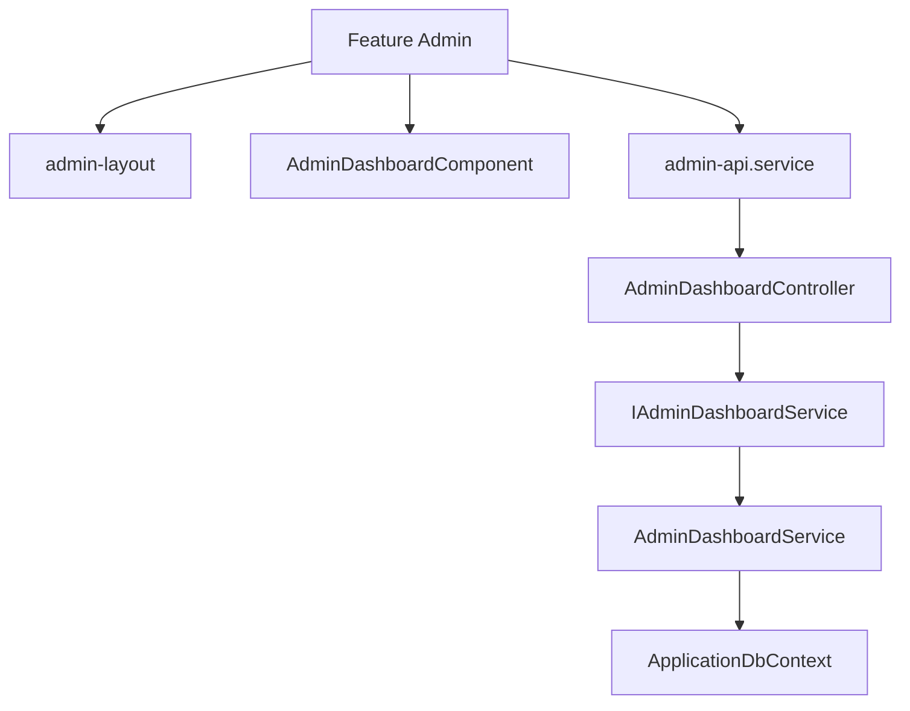

# Feature: Admin Subsystem & Management

## Overview
The Admin Subsystem offers workspace management, question repository adjustments, category tree modifications, import pipeline logs execution, and system-wide diagnostic statistics.

## Business Purpose
Allows platform administrators to seed learning tracks, import curated question spreadsheets, manage taxonomies, view user activity stats, and keep content up to date.

---

## 🔗 Architecture Graph Relations

### Frontend Components
* **Layouts & Pages**:
  * `[[admin-layout]]` — Admin sidebar and authentication verification.
  * `[[admin-dashboard]]` — Displays statistics grids, pending questions, and import logs.
* **Services**:
  * `[[admin-api.service]]` — Communicates with backend administrative APIs.

### Backend Components
* **Controllers**:
  * `[[AdminDashboardController]]` — Provides system-wide counts and aggregate status data.
  * `[[AdminQuestionsController]]` — CRUD operations for platform questions.
  * `[[AdminCategoriesController]]` — Hierarchical category edits.
* **Services**:
  * `[[IAdminDashboardService]]` / `[[AdminDashboardService]]` — Aggregates question, answer, user progress, and category database metrics.
