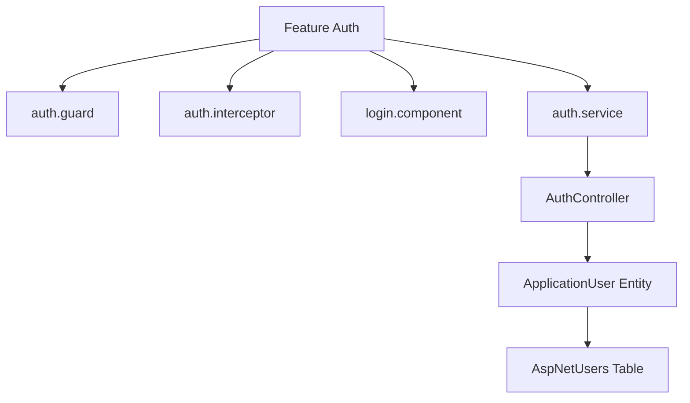

# Feature: Authentication & Security

## Overview
The Authentication module provides secure access to the FullStackMastery platform, implementing **JWT Bearer Token Authentication** on the backend and local storage token management with route guards and interception on the frontend.

## Business Purpose
Ensures only authorized users can access learning features, tracks individual progress, and restricts administrative endpoints to users with the `Admin` role.

---

## 🔗 Architecture Graph Relations

### Frontend Components
* **Pages & Components**:
  * `[[login.component]]` — Handles user input and triggers login actions.
  * `[[register.component]]` — Registration form for creating new accounts.
* **Services & Guards**:
  * `[[auth.service]]` — Handles login, logout, and stores token status in memory.
  * `[[auth.guard]]` — Activates route checks for student and admin access.
  * `[[auth.interceptor]]` — Appends Bearer token to all outgoing API requests.

### Backend Components
* **Controllers**:
  * `[[AuthController]]` — Exposes `/api/auth/login` and `/api/auth/register` endpoints.
* **Entities**:
  * `[[ApplicationUser]]` — Custom identity user carrying user profile data and relations to user progress records.

### Database Tables
* `[[AspNetUsers]]` — Stores user login credentials, password hashes, and security logs.
