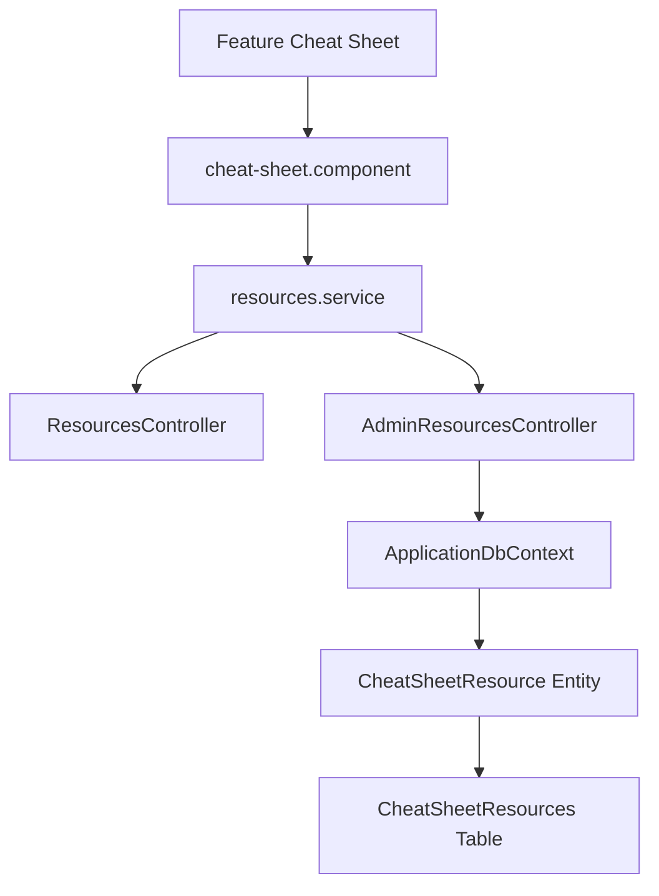

# Feature: Cheat Sheet Hub

## Overview
The Cheat Sheet feature provides quick reference materials, cheat sheets, syntax summaries, and downloadable files mapping to specific technology domains.

## Business Purpose
Gives candidates immediate access to cheat sheets (like SQL cheats, command-line cheats, and Angular lifecycle charts) to assist in quick review sessions.

---

## 🔗 Architecture Graph Relations

### Frontend Components
* **Pages & Components**:
  * `[[cheat-sheet.component]]` — Grid list displaying active resources, search bars, and download triggers.
* **Services**:
  * *Standard HTTP Client calls mapping backend endpoints.*

### Backend Components
* **Controllers**:
  * `[[ResourcesController]]` — Public endpoints serving category reference listings.
  * `[[AdminResourcesController]]` — Administrative actions supporting additions and removals of resource links.
* **Entities**:
  * `[[CheatSheetResource]]` — Defines cheatsheet metadata (Title, LinkUrl, Type, CategoryId).

### Database Tables
* `[[CheatSheetResourcesTable]]` — Primary store for cheatsheet listings.
