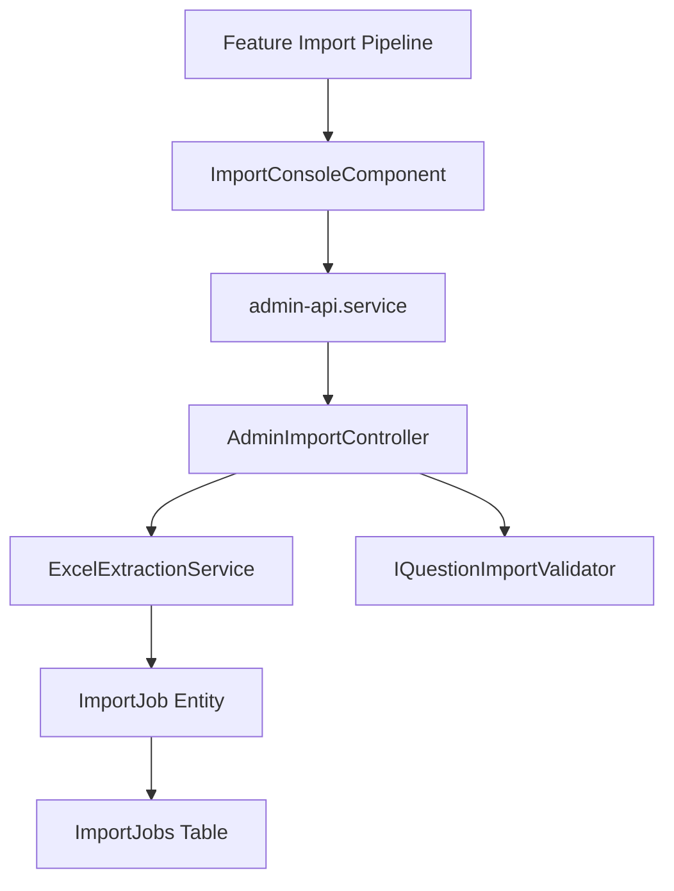

# Feature: Excel & JSON Import Pipeline

## Overview
The Import Pipeline is a highly robust, multi-stage ETL system. It extracts interview question and answer mappings from files (Excel, JSON, CSV), validates rows across a 6-stage lifecycle, and executes intelligent upserts.

## Business Purpose
Reduces administrative overhead for content curators, enabling rapid loading and merging of large question sets while protecting database integrity from duplicate or malformed records.

---

## 🔗 Architecture Graph Relations

### Frontend Components
* **Pages & Panels**:
  * `[[import-console]]` — Admin panel offering drag-and-drop file uploads, dry-run modal warnings, and log inspectors.
* **Services**:
  * `[[admin-api.service]]` — Pulls active import job progress streams and historical logs.

### Backend Components
* **Controllers**:
  * `[[AdminImportController]]` — Receives file streams and orchestrates dry-runs or real executions.
  * `[[ImportJobsController]]` / `[[ImportLogsController]]` — Serving status information and row-level diagnostics.
* **Services**:
  * `[[ExcelExtractionService]]` — ClosedXML extractor handling complex merged cells, sheets, and cell formulas.
  * `[[IQuestionImportValidator]]` — Performs schema checks, duplicates scanning, and difficulty mapping.
* **Entities**:
  * `[[ImportJob]]` — Represents a file ingestion batch, tracking active progress counters.
  * `[[ImportLog]]` — Append-only table storing diagnostic snapshots and error/success summaries per row.

### Database Tables
* `[[ImportJobsTable]]` — Stores summary statuses (Pending, Running, Completed, Failed).
* `[[ImportLogsTable]]` — Granular log records details mapped to specific rows.
