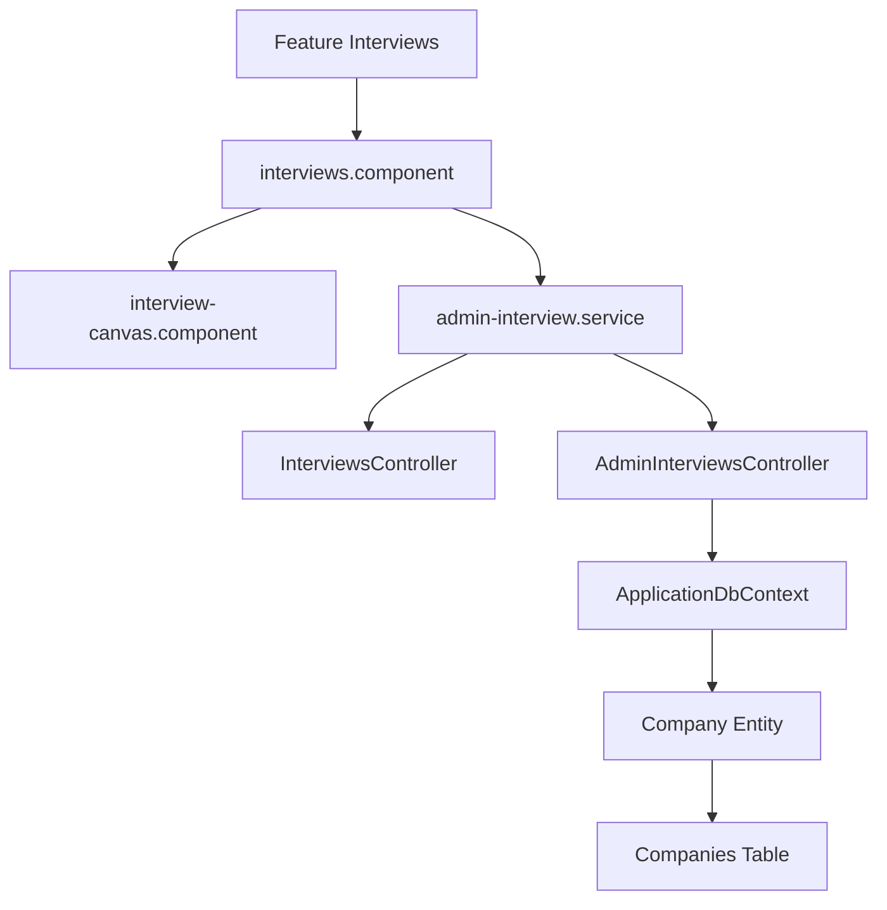

# Feature: Interview Canvas & Company Tracking

## Overview
The Interview tracking system maps target companies and active interview pipelines, including rounds (Phone, Technical, System Design, Fit) and the technical questions encountered.

## Business Purpose
Allows candidates to track company-specific interview structures, prep for specific round structures, analyze questions asked by specific companies, and design solution paths.

---

## 🔗 Architecture Graph Relations

### Frontend Components
* **Pages & Components**:
  * `[[interviews.component]]` — List tracking target organizations and upcoming interviews.
  * `[[interview-canvas.component]]` — Kanban workspace mapping active interview loops by stages.
* **Services**:
  * `[[admin-interview.service]]` — Pulls round schedules and company mappings.

### Backend Components
* **Controllers**:
  * `[[InterviewsController]]` — Public endpoints serving read-only company round question matrices.
  * `[[AdminInterviewsController]]` — Administrative actions supporting company additions, round configs, and linking questions.
* **Entities**:
  * `[[Company]]` — Represents a corporate entity.
  * `[[CompanyInterview]]` — Tracks role, level, date, and user details.
  * `[[InterviewRound]]` — Specifies rounds under an interview.
  * `[[InterviewRoundQuestion]]` — Join table mapping questions to rounds with custom display sorting.

### Database Tables
* `[[CompaniesTable]]` — Primary company registry.
* `[[CompanyInterviewsTable]]` — Primary interview loops record.
* `[[InterviewRoundsTable]]` — Stores round focus configurations.
* `[[InterviewRoundQuestionsTable]]` — Maps questions to rounds.
