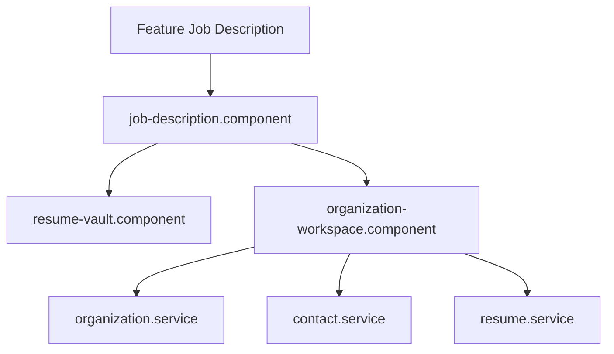

# Feature: Job Description & Org Workspace

## Overview
The Job Description workspace (also known as the Organization Workspace) tracks job applications, resumes, networking contacts, and preparation notes.

## Business Purpose
Allows candidates to align their prep work to specific companies, upload tailored resumes, trace company organizational structures, list HR/technical contacts, and organize prep questions specific to targeted roles.

---

## 🔗 Architecture Graph Relations

### Frontend Components
* **Pages & Tabs**:
  * `[[job-description.component]]` — Main landing layout mapping active organizations and job leads.
  * `[[resume-vault.component]]` — Repository dashboard tracking parsed resume files and scores.
  * `[[organization-workspace.component]]` — Workplace console managing details for targeted hiring organizations.
* **Services**:
  * `[[organization.service]]` — Manages metadata mapping organization details.
  * `[[contact.service]]` — Handles networking details (referrals, hiring managers, engineers).
  * `[[resume.service]]` — Coordinates resume document lists and uploads.

### Backend Components
* *Currently implemented client-side with potential API integrations pending in subsequent phases.*
