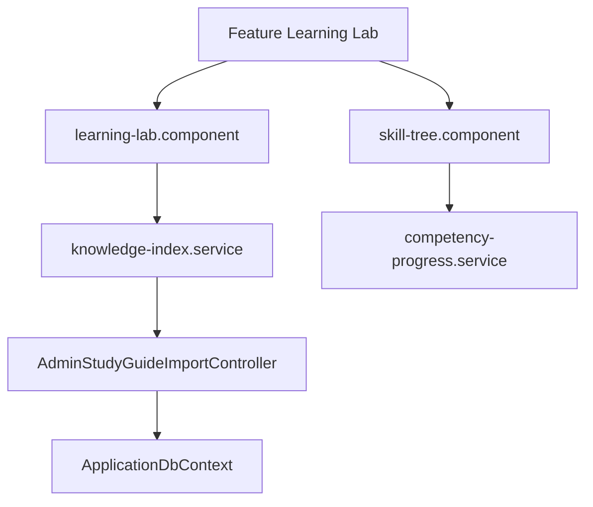

# Feature: Learning Lab & Skill Tree

## Overview
The Learning Lab provides interactive visual roadmaps, coding widgets, and markdown-based study guides mapped to specific technical skills and core competencies.

## Business Purpose
Enhances technical preparation through visual tree navigation, step-by-step competency logs, code example playgrounds, and diagrams.

---

## 🔗 Architecture Graph Relations

### Frontend Components
* **Pages & Panels**:
  * `[[learning-lab.component]]` — Main landing panel displaying modules, checklists, and guides.
  * `[[skill-tree.component]]` — Interactive structural dependency map showing core categories.
* **Shared UI Widgets**:
  * `[[knowledge-index]]` — Hierarchical checklist for tracking self-ratings of skills.
  * `[[mermaid-viewer]]` — Renders architecture workflows and block diagrams.
* **Services**:
  * `[[knowledge-index.service]]` — Handles fetching progress rates for knowledge structures.
  * `[[competency-progress.service]]` — Manages completion flags for skill nodes.

### Backend Components
* **Controllers**:
  * `[[AdminStudyGuideImportController]]` — Administrative actions supporting study guide loading.
* **Entities**:
  * `[[Competency]]` — High-level topic specification (e.g. ASP.NET Core, Database Tuning).
  * `[[Skill]]` — Granular capability maps (e.g. Middleware registration, Index creation).
  * `[[SkillCategory]]` — Classifications grouping skills together.
  * `[[StudyGuideSection]]` — Text blocks containing instructions, solutions, and diagrams.

### Database Tables
* `[[CompetenciesTable]]` — Stores core competencies keys and tags.
* `[[SkillsTable]]` — Maps skills to parent categories.
* `[[StudyGuideSectionsTable]]` — Stores markdown content blocks.
