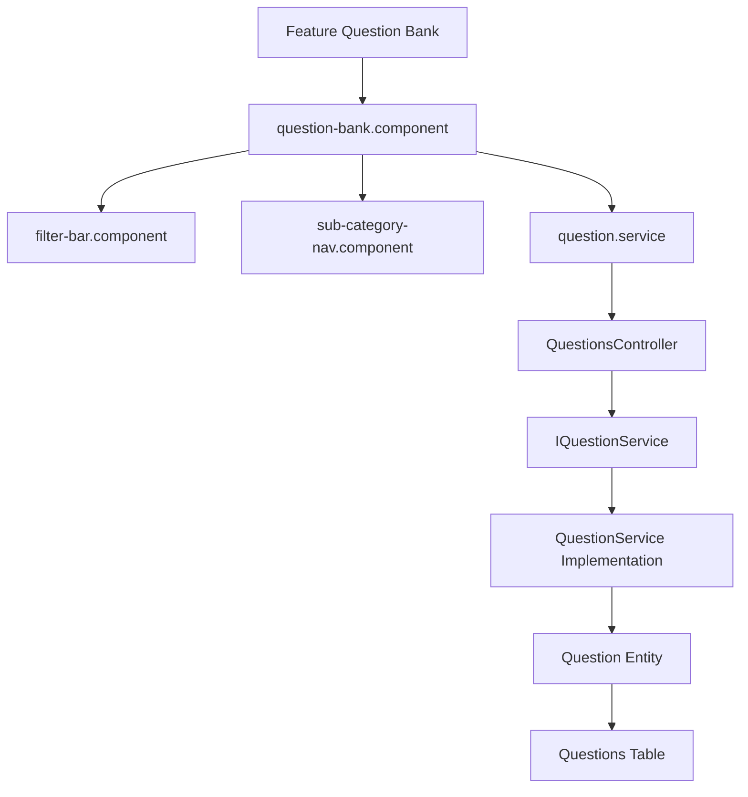

# Feature: Question Bank & Taxonomies

## Overview
The Question Bank feature allows students to browse, search, and filter a hierarchical repository of technical interview questions, grouped by self-referencing category paths (e.g. `Backend` -> `.NET` -> `ASP.NET Core Middleware`).

## Business Purpose
Provides structured exploration of technical competency topics, allowing users to drill down to specific categories and view detailed mock questions.

---

## 🔗 Architecture Graph Relations

### Frontend Components
* **Pages & Shared Views**:
  * `[[question-bank.component]]` — Hierarchical navigation panel and search listing view.
  * `[[filter-bar.component]]` — Search text inputs, difficulty selection dropdowns.
  * `[[sub-category-nav.component]]` — Displays parent-child breadcrumbs or sub-categories.
* **Services**:
  * `[[question.service]]` — Pulls paginated and category-filtered questions from backend.
  * `[[category.service]]` — Fetches hierarchical category trees.

### Backend Components
* **Controllers**:
  * `[[QuestionsController]]` — Serves public questions, paginated search results, and category scopes.
  * `[[CategoriesController]]` — Serves tree layouts and flat category collections.
* **Services**:
  * `[[IQuestionService]]` / `[[QuestionService]]` — Encapsulates paging logic, soft-delete filtering, and related entity preloading.
  * `[[ICategoryService]]` / `[[CategoryService]]` — Traverses self-referencing hierarchical trees.

### Database Tables
* `[[QuestionsTable]]` — Primary store for question titles, metadata, status, and category foreign keys.
* `[[AnswersTable]]` — Stores 1:1 answer markdown contents.
* `[[CategoriesTable]]` — Stores hierarchy definitions using self-referencing child/parent rows.
