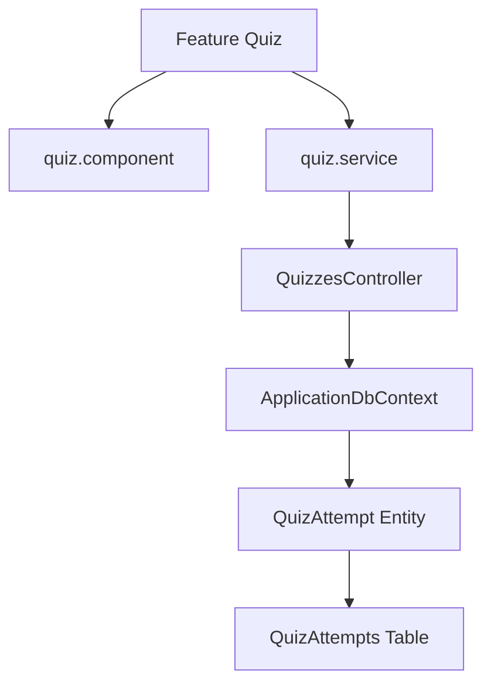

# Feature: Practice & Assessment Quizzes

## Overview
The Quiz feature supports two learning modes: **Practice Mode** (immediate answer feedback) and **Assessment Mode** (timed, scored test behavior).

## Business Purpose
Allows students to test their knowledge, track performance scores over time, and simulate real interview pressures with timed constraints.

---

## 🔗 Architecture Graph Relations

### Frontend Components
* **Pages & Components**:
  * `[[quiz-practice.component]]` — Renders immediate explanation feedback on selection.
  * `[[quiz-assessment.component]]` — Implements timer limits and hides immediate feedback until final grading.
* **Services**:
  * `[[quiz.service]]` — Handles fetching quiz sessions and reporting attempt results.

### Backend Components
* **Controllers**:
  * `[[QuizzesController]]` — API endpoints for generating new quiz sessions, scoring answers, and retrieving historic attempts.
* **Entities**:
  * `[[QuizAttempt]]` — Represents a single user's quiz attempt session.
  * `[[QuizQuestion]]` — Maps questions to attempt sessions, tracking user answers and marks.

### Database Tables
* `[[QuizAttemptsTable]]` — Primary table for user score, timestamp, and duration fields.
* `[[QuizQuestionsTable]]` — Join table mapping questions to attempts with individual scores.
