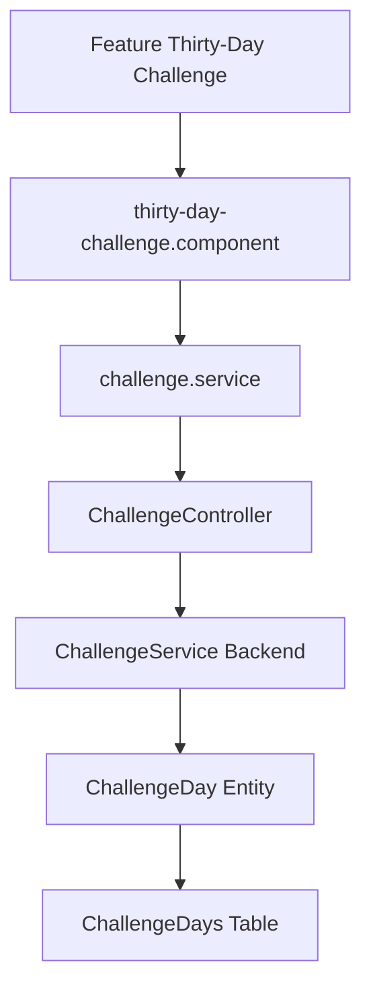

# Feature: 30-Day Study Challenge

## Overview
The 30-Day Challenge guides students through a curated, day-by-day learning schedule covering critical full-stack engineering competencies (e.g. Clean Architecture, EF Core, RxJS, Angular Signals).

## Business Purpose
Creates high-engagement structured learning paths, promoting daily practice habit loops and tracking milestone completions leading to job readiness.

---

## 🔗 Architecture Graph Relations

### Frontend Components
* **Pages**:
  * `[[thirty-day-challenge.component]]` — Provides a calendar dashboard showing completed, active, and locked days, daily reading materials, and action buttons.
* **Services**:
  * `[[challenge.service]]` — Pulls daily content checklists and coordinates progress submissions.

### Backend Components
* **Controllers**:
  * `[[ChallengeController]]` — Serves day definitions, daily coding challenges, and tracks challenge milestones.
* **Services**:
  * `[[IChallengeService]]` / `[[ChallengeService]]` — Manages completion states, day unlock constraints, and seeder definitions.
* **Entities**:
  * `[[ChallengeDay]]` — Defines a daily task template containing focal areas and links to documentation.
  * `[[UserChallengeProgress]]` — Represents user-specific progress maps tracking completed days.

### Database Tables
* `[[ChallengeDaysTable]]` — Maps out day indexes, focal titles, and instructions.
* `[[UserChallengeProgressesTable]]` — Stores completion history and unlock dates per user.
